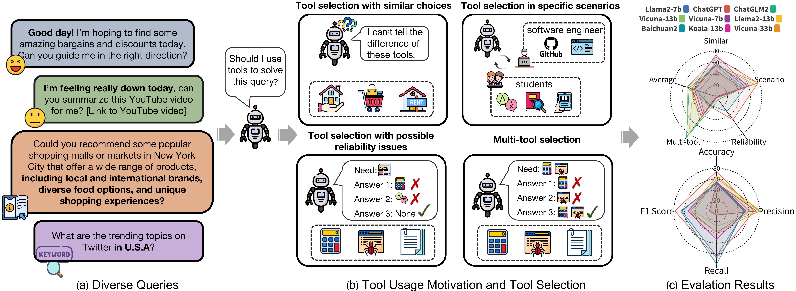
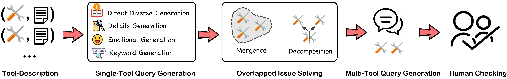
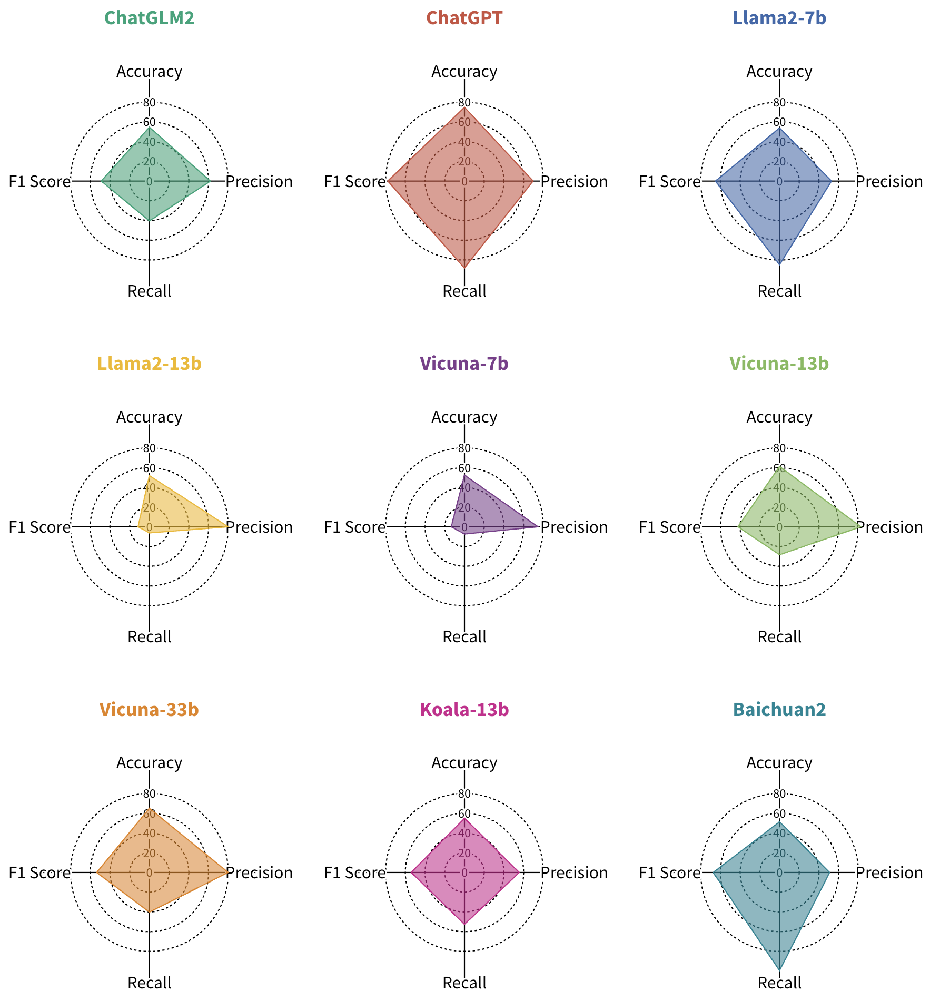
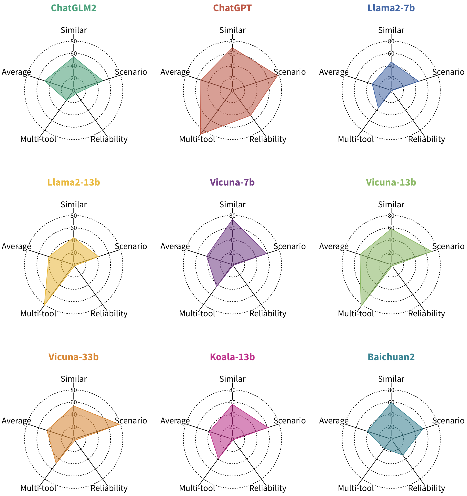

<div align="center">

</div>

# MetaTool Benchmark: Deciding Whether to Use Tools and Which to Use

<p align="center">
   <a href="https://atlas.nomic.ai/map/a43a6a84-4453-428a-8738-2534d7bf0b89/b2b8134b-a37e-45d2-a0d9-765911f27df6" target="_blank">🌐 Dataset Website</a> | <a href="https://arxiv.org/abs/2310.03128" target="_blank">📃 Paper </a> | <a href="https://github.com/HowieHwong/MetaTool/issues"> 🙋 Welcome Contribution  </a> | <a href="https://github.com/HowieHwong/MetaTool/blob/master/LICENSE"> 📜 License</a>
</p>


## Introduction

We introduce **MetaTool**, a benchmark designed to evaluate whether LLMs have tool usage awareness and can correctly choose tools. It includes:

- **ToolE Dataset**: This dataset contains various types of user queries in the form of prompts that trigger LLMs to use tools, including both single-tool and multi-tool scenarios.
- **Various Tasks**: we set the tasks for both tool usage awareness and tool selection. We define four subtasks from different perspectives in tool selection, including tool selection with similar choices, tool selection in specific scenarios, tool selection with possible reliability issues, and multi-tool selection.
- **Results on nine LLMs**: We conduct experiments involving nine popular LLMs and find that the majority of them still struggle to effectively select tools, highlighting the existing gaps between LLMs and genuine intelligent agents.


<div align="center">

</div>

## ToolE Dataset

### Dataset generation
We introduce the **ToolE** dataset with 21.1k diverse user queries related to tool usage. 
Each entry within the dataset comprises a user request (i.e., query) along with its corresponding tool name and tool description. These queries serve as triggers that prompt LLMs to utilize specific tools.

<div align="center">

</div>


### Dataset statistics

<center>

| Generation method              | Model                          | Sample number                                         |
|--------------------------------|--------------------------------|-------------------------------------------------------|
| Direct generation              | ChatGPT, GPT-4                 | 11,700                                                |
| Emotional generation           | ChatGPT                        | 7,800                                                 |
| Keyword generation             | ChatGPT                        | 1,950                                                 |
| Details generation             | ChatGPT                        | 7,800                                                 |
| Multi-tool generation          | ChatGPT, GPT-4                 | 1,624                                                 |
| After checking                 | \                              | 21,127 (20,630 single-tool + 497 multi-tool)          |

</center>

### Dataset files

- Single-tool data: `dataset/data/all_clean_data.csv`
- Multi-tool data: `dataset/data/multi_tool_query_golden.json`
- All tool description: `dataset/plugin_des.json`
- meta data from OpenAI plugin store: `dataset/plugin_info.json`
- Merged data description: `dataset/big_tool_des.json`
- Embedding of tool description: `dataset/tool_embedding.pkl`
- Scenario tool list (Table 10 in the paper): `dataset/scenario`

## Evaluation Results

<center>
<h3>Tool usage awareness</h3>
</center>

<div align="center">

</div>


<center>
<h3>Tool selection</h3>
</center>


<div align="center">

</div>


## Quick Start

First, create an `.env` file in the (put it next to `src/generation/.example.env` and include the same fields). 

Now, you can run the following command for a quickstart (which downloads the model and prepares the data for you): `bash quickstart.sh -m <model_name> -t <task>`. 

Alternatively, you can perform the below. Then, follow the results generation section.

### Install the packages:
```shell
pip install --upgrade pip
pip install -r requirements.txt
```

### Download the models:
- Set the `HF_HOME` environment variable in the `src/generation/.env` file to specify the Hugging Face model cache folder, e.g., `HF_HOME=/path/to/your/huggingface/cache`.

- `--model-path`: Specify the Hugging Face model repository name to download.
```shell
python src/generation/model_download.py --model_path lmsys/vicuna-7b-v1.3
```

### Tool embedding
We use `milvus` to  store tool embedding and conduct similarity searching.

To install and run `milvus` locally: https://milvus.io/docs/install_standalone-docker.md


Then run the following command to build a `milvus` database.
```python
python src/embedding/milvus_database.py
```

### Construct prompt data:
The pre-defined prompt templates are in `src/prompt/prompt_template`

If you want to generate the prompts for all tasks, run following command:
```shell
python src/prompt/prompt_construction.py
```
For single task prompts, run following command:
```shell
python src/prompt/prompt_construction.py [task]
```
Replace `[task]` with one of the following task options:

- `similar`: Similar tool selection.
- `scenario`: Scenario tool selection.
- `reliable`: Reliability tool selection.
- `multi`: Multi-tool prompt construction.
- `all`: All tasks.

### Generate the results:
#### Parameters
You can generate results by running the run.sh script. You may need to modify the running parameters within the run.sh file to suit your specific needs.
- `--test_type`: Choose between `tool_test_thought` or `tool_test_action` depending on your testing needs.
- `--model-path`: Specify the Hugging Face model repository name.
```shell
sh src/generation/run.sh
```


## Troubleshooting

If you face an import error from Python, you may need to add this directory to your Python path:
```shell
# Add sys path
src_path="$(pwd)/src"
export PYTHONPATH="$PYTHONPATH:$src_path"
```


## Citation

```
@article{huang2023metatool,
  title   = {MetaTool Benchmark: Deciding Whether to Use Tools and Which to Use},
  author  = {Yue Huang and Jiawen Shi and Yuan Li and Chenrui Fan and Siyuan Wu and Qihui Zhang and Yixin Liu and Pan Zhou and Yao Wan and Neil Zhenqiang Gong and Lichao Sun},
  year    = {2023},
  journal = {arXiv preprint arXiv: 2310.03128}
}
```